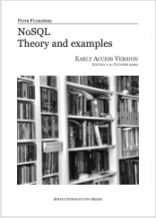

# NoSQL. Theory and examples
This is a repository about my book entitled: *[NoSQL. Theory and examples](https://fulmanski.pl/books/pl/index.php)*

You can download some sample directly from my web page *[NoSQL. Theory and examples](https://fulmanski.pl/books/pl/index.php)* or buy it on Apple Books (soon).

Current version is: *1.0, October 2020 (**early access**), build number 202011051140*.

Give this book a try, and please let me know what you think. Any feedback is very much encouraged and welcomed! If you think that my time is worth this effort, you can support what I’m doing now and help me finalize this project. Please use [email](mailto:book@fulmanski.pl) or [GitHub Issues](https://github.com/fulmanp/book-NoSQL-Theory-and-examples/issues) to give your positive or negative but in all cases constructive feedback.

